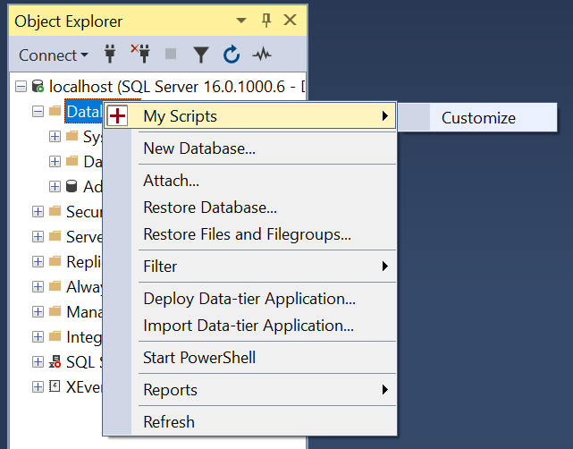
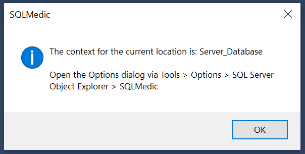

# [SSMS Object Explorer Menu](https://github.com/brink-daniel/ssms-object-explorer-menu)

SSMS Object Explorer Menu is a free and open source extension for SQL Server Management Studio (SSMS) written in C#. It allows custom menu items to be added to the right-click context menu in the Object Explorer window. The menu items can be used to execute any tsql script file or inline tsql statement.

The project homepage is <https://sqlmedic.com>.

Source code, documentation and issues can be found at <https://github.com/brink-daniel/ssms-object-explorer-menu>.

Information on how to access the Object Explorer and TreeView control was learnt by studying Nicholas Ross's [SSMS-Schema-Folders](https://github.com/nicholas-ross/SSMS-Schema-Folders) project.

## Compatibility

This extension has only been tested and used with **SQL Server Management Studio 19.1**.

You can download the latest version of SSMS for free from [Microsoft](https://learn.microsoft.com/en-us/sql/ssms/download-sql-server-management-studio-ssms).

Compatibility with other extensions is still being tested. 

| Extension | Status |
|-----------|--------|
| [SQL Search](https://www.red-gate.com/products/sql-search) | Compatible |
| [SQL Prompt](https://www.red-gate.com/products/sql-prompt) | Compatible |

Please let us know what other extensions you use in SSMS. We'll try our best to ensure compatibility.

### Recompile for SSMS 18.x

SSMS 18.x is not officially supported, but the SSMS Object Explorer Menu extension can be recompiled with the correct dll files for SSMS 18.x and made to work.
Download the [source code](https://github.com/brink-daniel/ssms-object-explorer-menu) and replace the lib/SqlPackageBase.dll and lib/SqlWorkbench.Interfaces.dll with your local SSMS 18.x version of the same files found in C:\Program Files (x86)\Microsoft SQL Server Management Studio 18\Common7\IDE. Then recompile the extension and follow the installation instructions below.

## Install

[Download the latest release](https://github.com/brink-daniel/ssms-object-explorer-menu/releases)

You must unblock the zip file **before** extracting it. Right click on the zip file in Windows Explorer and select Properties. 
If you see an `Unblock` button or checkbox then click it. 

Extract the zip file and copy the SSMSObjectExplorerMenu folder into the SSMS extension folder. Remove or replace any previous version. 

The default install location is `C:\Program Files (x86)\Microsoft SQL Server Management Studio 19\Common7\IDE\Extensions`.

When installed correctly, you should have the following folder & file structure:
* C:\Program Files (x86)\Microsoft SQL Server Management Studio 19\Common7\IDE\Extensions\SSMSObjectExplorerMenu\LICENSE
* C:\Program Files (x86)\Microsoft SQL Server Management Studio 19\Common7\IDE\Extensions\SSMSObjectExplorerMenu\README.md
* C:\Program Files (x86)\Microsoft SQL Server Management Studio 19\Common7\IDE\Extensions\SSMSObjectExplorerMenu\SSMSObjectExplorerMenu.dll
* C:\Program Files (x86)\Microsoft SQL Server Management Studio 19\Common7\IDE\Extensions\SSMSObjectExplorerMenu\SSMSObjectExplorerMenu.pkgdef

Please note that SSMS 19 does allow installing extensions in a different location. You may need to search around for the Extensions folder.

### How to add menu items to the Object Explorer

Once the SSMS Object Explorer Menu add-in is installed, new menu items can be added to the Object Explorer using these steps:
1. Right-click on the node in the Object Explorer where you would like to add a context menu item and select `Customize` from the SQLMedic menu.
    
2. Take note of the `context` of your current location, e.g. `Server_Database_UserTablesFolder`, in the displayed dialog.
    
3. Open the Options dialog window in SSMS `Tools > Options > SQL Server Object Explorer > SQLMedic` and complete the Name, Path and Context settings for the new menu item.
    

## Settings

Up to 20 menu items can be configured via the Options dialog window in SSMS 
`Tools > Options > SQL Server Object Explorer > SQLMedic`

The following settings are available for each menu item:
* Confirm - Ask confirmation to continue before executing script or tsql statement
* Context - Set the tree node level where to display the menu item.
     - All
	 - Server
	 - Server/DatabasesFolder
	 - Server/Database
	 - Server/Database/UserTablesFolder
	 - Server/Database/Table
	 - Server/Database/StoredProceduresFolder
	 - Server/Database/StoredProcedure
	 - Server/JobServer
	 - Server/JobServer/JobsFolder
	 - Server/JobServer/Job
* Enabled - Show/hide the menu item.
* Execute - Automatically run the selected script or tsql statements.
* Name - Text displayed on the menu item.
* Path - Location of script file to execute OR tsql statements to execute.

### Text substitution

The following tags are replaced in tsql scripts and statements before execution:

* `{SERVER}`
* `{DATABASE}`
* `{SCHEMA}`
* `{TABLE}`
* `{STORED_PROCEDURE}`
* `{JOB}`

### Sample scripts

| Context | Script |
|---------|--------|
| All &nbsp; | [text_substitution_demo.sql](https://github.com/brink-daniel/ssms-object-explorer-menu/blob/main/scripts/text_substitution_demo.sql) Demo of text substitution |
| Server_Database_Table &nbsp; | [script_data_as_insert.sql](https://github.com/brink-daniel/ssms-object-explorer-menu/blob/main/scripts/script_data_as_insert.sql) Script data as insert statements |
| Server_Database_StoredProcedure &nbsp; | [stored_procedure_unit_test.sql](https://github.com/brink-daniel/ssms-object-explorer-menu/blob/main/scripts/stored_procedure_unit_test.sql) Run tSQLt unit test for a stored procedure |
| Server_Database_StoredProceduresFolder &nbsp; | [stored_procedure_unit_test_all.sql](https://github.com/brink-daniel/ssms-object-explorer-menu/blob/main/scripts/stored_procedure_unit_test_all.sql) Run all tSQLt unit tests |

More tsql scripts are available [here](Scripts.md).

## Compiling the source code

Requirements for compiling the source code:
* Visual Studio 2022
* Toolset: Visual Studio extension development

The Visual Studio extension development toolset can be installed via the `Tools > Get Tools and Features` menu inside Visual Studio.

## Roadmap

Features are planned for future releases:

* Import/export settings as xml
* Reorganise/sort menu item
* Remove all SQLMedic branding
* Optional horizontal lines between menu items
* Sub-menus
* Optional icons on menu items
* Installer
* Unlimited number of menu items

## Known Issues

### Not running/No options

This happens when Windows security blocks dll files downloaded from the internet. Unblock the zip file BEFORE extracting it.

Please report any issues to <https://github.com/brink-daniel/ssms-object-explorer-menu/issues>.

## Change Log

### v1.4 (2023-07-22)
* Usability improvements

### v1.3 (2023-07-15)
* Add support for custom menu items on SQL Agent jobs

### v1.2 (2023-07-11)
* Allow custom branding

### v1.1 (2023-07-07)
* Optimize logic for retrieving tree node context information

### v1.0 (2023-07-04)
* Public beta release.
