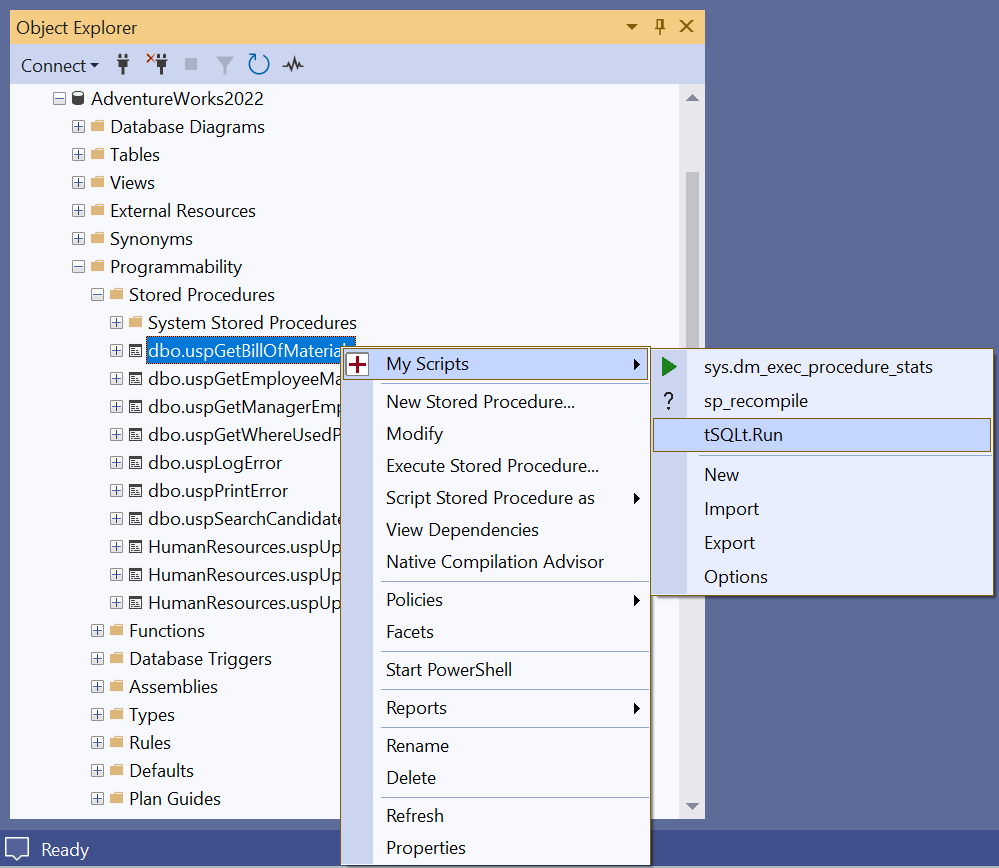
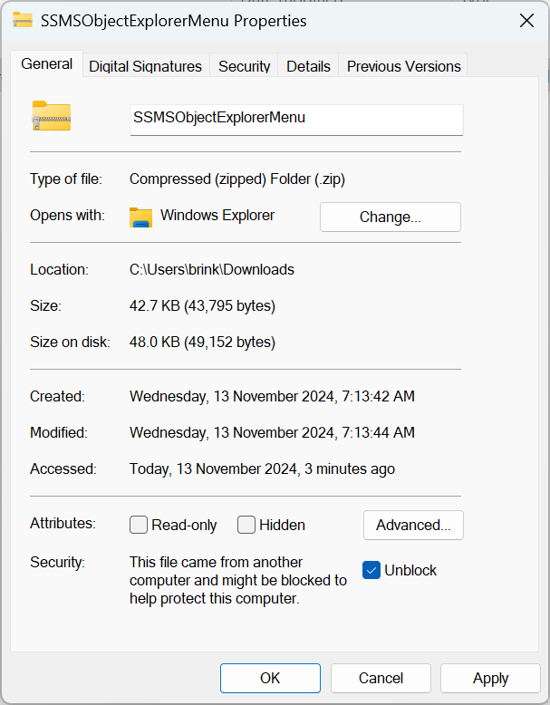
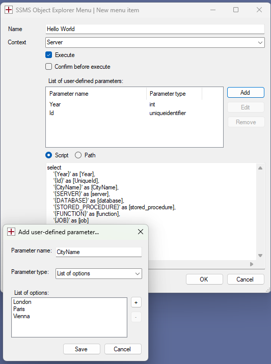

# SSMS Object Explorer Menu

SSMS Object Explorer Menu is a free and open source extension for SQL Server Management Studio (SSMS) written in C#. It allows custom menu items to be added to the right-click context menu in the Object Explorer window. The menu items can be used to execute any tsql script file or inline tsql statement. When the menu item is selected, a new query window is opened displaying your tsql script. The menu item can be configured to automatically substitute tags in the script and also execute it. 

The project homepage is [https://sqlmedic.com](https://sqlmedic.com).

[](https://github.com/brink-daniel/ssms-object-explorer-menu/releases)
[](https://github.com/brink-daniel/ssms-object-explorer-menu/blob/main/LICENSE)




## Install

The installation process is currently manual. We have an item on our roadmap to create an installer for the SSMS Object Explorer Menu extension, but for now you will have to manually extract the files and copy them into SSMS extensions folder.

[Download the latest release](https://github.com/brink-daniel/ssms-object-explorer-menu/releases)

You must unblock the zip file **before** extracting it. Right click on the zip file in Windows Explorer and select Properties. 
If you see an `Unblock` button or checkbox then click it. 



Extract the zip file and copy the SSMSObjectExplorerMenu folder into the SSMS extension folder. Remove or replace any previous version. 

The default install location is `C:\Program Files\Microsoft SQL Server Management Studio 21\Release\Common7\IDE\Extensions\SSMSObjectExplorerMenu`.

When installed correctly, you should have the following folder & file structure:
* C:\Program Files\Microsoft SQL Server Management Studio 21\Release\Common7\IDE\Extensions\\**SSMSObjectExplorerMenu**\\**LICENSE**
* C:\Program Files\Microsoft SQL Server Management Studio 21\Release\Common7\IDE\Extensions\\**SSMSObjectExplorerMenu**\\**README.md**
* C:\Program Files\Microsoft SQL Server Management Studio 21\Release\Common7\IDE\Extensions\\**SSMSObjectExplorerMenu**\\**SSMSObjectExplorerMenu.dll**
* C:\Program Files\Microsoft SQL Server Management Studio 21\Release\Common7\IDE\Extensions\\**SSMSObjectExplorerMenu**\\**SSMSObjectExplorerMenu.pkgdef**

Please note that SSMS 21 does allow installing extensions in a different location. You may need to search around for SSMS's extensions folder.


### How to add menu items to the Object Explorer

Once the SSMS Object Explorer Menu add-in is installed, new menu items can be added to the Object Explorer using either of the following two methods:
1. Right-click on the node in the Object Explorer where you would like to add a context menu item and select `Add menu item` from the `My Scripts` menu. 
    
    
2. Open the Options dialog window in SSMS `Tools > Options > SQL Server Object Explorer > SSMS Object Explorer Menu` and add new menu items to the collection. Menu items can also be rearranged or removed using the Options dialog. 
    


## Settings

The following settings are available for each menu item:
* Confirm - Ask confirmation to continue before executing a script file or inline tsql statement
* Context - Tree node level where to display the menu item. For example:
     - All
	 - Server
	 - Server/DatabasesFolder
	 - Server/Database
	 - Server/Database/UserTablesFolder
	 - Server/Database/Table
	 - Server/Database/View
	 - Server/Database/StoredProceduresFolder
	 - Server/Database/StoredProcedure
	 - Server/JobServer
	 - Server/JobServer/JobsFolder
	 - Server/JobServer/Job
* Enabled - Show/hide the menu item.
* Execute - Automatically run the selected script or tsql statements when the menu item is selected.
* Name - Text displayed on the menu item.
* Script - Inline tsql statements OR path to script file.


### Text substitution

The following tags are replaced in tsql scripts and statements before execution:

* `{SERVER}`
* `{DATABASE}`
* `{SCHEMA}`
* `{TABLE}`
* `{VIEW}`
* `{STORED_PROCEDURE}`
* `{FUNCTION}`
* `{JOB}`
* `{YYYY-MM-DD}`
* `{HH:mm:ss}`
* `{YYYY-MM-DD HH:mm:ss}`

#### Example 1

```sql
select
    '{SERVER}' as [server]
    , '{DATABASE}' as [database]
    , '{SCHEMA}' as [schema]
    , '{TABLE}' as [table]
    , '{VIEW}' as [view]	
    , '{STORED_PROCEDURE}' as [stored_procedure]
    , '{FUNCTION}' as [function]
    , '{JOB}' as [job]
    , '{YYYY-MM-DD}' as [date]
    , '{HH:mm:ss}' as [time]
    , '{YYYY-MM-DD HH:mm:ss}' as [datetime]
```

#### Example 2

```sql
select top 10
	*
from {DATABASE}.{SCHEMA}.{TABLE}
```


## Compatibility

This extension has been tested and used with **SQL Server Management Studio 21.1.3**.

You can download the latest version of SSMS for free from [Microsoft](https://learn.microsoft.com/en-us/sql/ssms/download-sql-server-management-studio-ssms).

Compatibility with other extensions are still being tested. 

| Extension                                                    | Status     |
| ------------------------------------------------------------ | ---------- |
| [Redgate SQL Search](https://www.red-gate.com/products/sql-search) | Compatible |
| [Redgate SQL Prompt](https://www.red-gate.com/products/sql-prompt) | Compatible |

Please let us know what other extensions you use in SSMS. We'll try our best to ensure compatibility.

### SQL Server Management Studio 20.x

SSMS 20.x is no longer supported. The last version compatibile with SSMS 20.x is [version 2.3](https://github.com/brink-daniel/ssms-object-explorer-menu/releases/tag/v2.3). Please consider upgrading to the latest version of [SQL Server Management Studio](https://learn.microsoft.com/en-us/sql/ssms/download-sql-server-management-studio-ssms).

### SQL Server Management Studio 19.x

SSMS 19.x is no longer supported. The last version compatibile with SSMS 19.x is [version 1.7.2](https://github.com/brink-daniel/ssms-object-explorer-menu/releases/tag/v1.7.2). Please consider upgrading to the latest version of [SQL Server Management Studio](https://learn.microsoft.com/en-us/sql/ssms/download-sql-server-management-studio-ssms).


## Compiling the source code

Requirements for compiling the source code:
* Visual Studio 2022
* Toolset: Visual Studio extension development

The Visual Studio extension development toolset can be installed via the `Tools > Get Tools and Features` menu inside Visual Studio.


## Roadmap

Features that are planned for future releases:

* Resolve two async warnings in code
* Installer* 


## FAQ

### Where can I get the source code for the SSMS Object Explorer Menu extension?

Source code, documentation and issues can be found at [https://github.com/brink-daniel/ssms-object-explorer-menu](https://github.com/brink-daniel/ssms-object-explorer-menu).

### How can I contribute to the project?

Please log any bugs found at [https://github.com/brink-daniel/ssms-object-explorer-menu/issues](https://github.com/brink-daniel/ssms-object-explorer-menu/issues). We also welcome pull requests. If you can fix a bug in the code or improve a feature, please do send us a pull request. We will happily review the change, test and merge it.

### Why do you only support the latest version of SSMS?

Currently we only have one developer working on the SSMS Object Explorer Menu extension and all work is unpaid and done in private time. Limiting the support to only the latest version of SSMS reduces the complexity of the project and makes the code easier to maintain and support. Due to the productivity enhancements that the SSMS Object Explorer Menu extension provides, we want this this project to survive for a very long time. Keeping it simple will help this project survive.

### Why was the SSMS Object Explorer Menu extension created?

We are all SQL Server Database Developers. We spend 8 hours a day in SSMS and lots of that time is spent using the [https://tsqlt.org](https://tsqlt.org) unit testing framework. tSQLt is amazing, but it lacks a free and open source UI. The SSMS Object Explorer Menu extension was created out the desire to be able to right-click on any stored procedure in the Object Explorer and select an option to run all unit tests related to the stored procedure. Subsequently,  the SSMS Object Explorer Menu extension evolved to allow any inline tsql statement or scripts files to be executed directly from the right-click menu in the Object Explorer.

If you are new  to tSQLt, have a look at their Quick Start guide [here](https://tsqlt.org/user-guide/quick-start/). We've also written a great article about how to solve the [Insert Exec Statement Cannot be Nested](https://www.sqlservercentral.com/articles/insert-exec-statement-cannot-be-nested-the-simple-solution) problem.

### Why is the SSMS Object Explorer Menu extension free and open source?

We love SSMS and especially [SSMS extensions](SSMSExtensionList.md). They make our lives better. We would love to see more extensions for SSMS. Please fork our [code](https://github.com/brink-daniel/ssms-object-explorer-menu), create something and share it.

### Why use the SSMS Object Explorer Menu extension when other extensions also allow users to create custom menu items?

SSMS extensions should only do one thing and do it well. The problem with a lot of extensions are that they have too many features and subsequently become intrusive or slow down SSMS. The SSMS Object Explorer Menu extension only adds context sensitive menu items to the Object Explorer in SSMS and have no impact on SSMS application loading times or UI performance. The menu items allow for the substitution of tags in their configured tsql script, with context specific values such as database, table or stored procedure name. 

### How do I uninstall the SSMS Object Explorer Menu extension?

Simply delete the `SSMSObjectExplorerMenu` folder from `C:\Program Files\Microsoft SQL Server Management Studio 21\Release\Common7\IDE\Extensions` and restart SQL Server Management Studio.


## Known Issues

### Not running/No options

This happens when Windows security blocks dll files downloaded from the internet. 


You must unblock the zip file **before** extracting it. Right click on the zip file in Windows Explorer and select Properties. 
If you see an `Unblock` button or checkbox then click it.


Please report any issues at [https://github.com/brink-daniel/ssms-object-explorer-menu/issues](https://github.com/brink-daniel/ssms-object-explorer-menu/issues).


## Credits

All development is done by [Daniel Brink](https://www.linkedin.com/in/brinkdaniel/).

Information on how to access the Object Explorer and TreeView control was learnt by studying Nicholas Ross's [SSMS-Schema-Folders](https://github.com/nicholas-ross/SSMS-Schema-Folders) project.


## Change Log

### v3.0 (2025-06-08)

* SSMS 21.1.3 compatibility

### v2.3 (2024-12-23)

* Add support for `{YYYY-MM-DD}`, `{HH:mm:ss}` and `{YYYY-MM-DD HH:mm:ss}` tags
* Fix bug causing the `{TABLE}` tag to be populated with the view name when using the `{VIEW}` tag

### v2.2 (2024-11-12)

* Add support for `{VIEW}` tag

### v2.1 (2024-03-23)

* Import/export menu items and tsql scripts as xml

### v2.0 (2024-03-21)

* SSMS 20.0 compatibility

### v1.7 (2023-08-01)
* Usability improvements
* Allow custom menu items on any node in the Object Explorer
* Add support for `{FUNCTION}` tag

### v1.6 (2023-07-25)
* Create unlimited number of menu items
* Reorder or remove menu items via Tools > Options dialog
* Quickly add menu items via new Add Menu Item dialog

### v1.5 (2023-07-23)
* New option to ask confirmation to continue before executing script or tsql statement.
* Removed SQLMedic branding

### v1.4 (2023-07-22)
* Usability improvements

### v1.3 (2023-07-15)
* Add support for custom menu items on SQL Agent jobs

### v1.2 (2023-07-11)
* Allow custom branding

### v1.1 (2023-07-07)
* Optimize logic for retrieving tree node context information

### v1.0 (2023-07-04)
* Public beta release.

