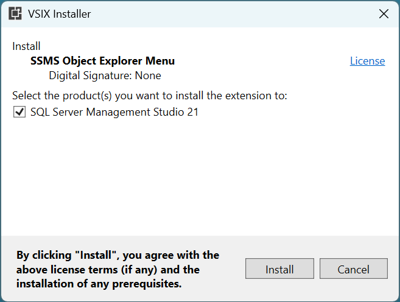

# SSMS Object Explorer Menu

SSMS Object Explorer Menu is a free, open-source extension for SQL Server Management Studio (SSMS), developed in C#. It enables users to add custom menu items to the right-click context menu within the Object Explorer window.

These menu items can be configured to run either external T-SQL script files or inline T-SQL statements. Upon selection, the extension opens a new query window displaying the script. It also supports tag substitution within scripts and optional automatic execution, streamlining routine database tasks and enhancing productivity.

The project homepage is [https://sqlmedic.com](https://sqlmedic.com).

[](https://github.com/brink-daniel/ssms-object-explorer-menu/releases)
[](https://github.com/brink-daniel/ssms-object-explorer-menu/blob/main/LICENSE)


## Install

There are two installation methods available for the SSMS Object Explorer Menu extension in SQL Server Management Studio (SSMS):
1. **Recommended Method** – Install using the VSIX installer package, which provides a streamlined and automated setup process.
2. **Manual Installation** – Alternatively, you can manually extract the extension files into the SSMS Extensions folder.


### VSIX installer (Recommended)

Download the [SSMSObjectExplorerMenu.vsix](https://github.com/brink-daniel/ssms-object-explorer-menu/releases) from the latest release.

Double click on the SSMSObjectExplorerMenu.vsix to run it and install the SSMS Object Explorer Menu extension.




### Manual installation

Download the [SSMSObjectExplorerMenu.zip](https://github.com/brink-daniel/ssms-object-explorer-menu/releases) from the latest release

You must unblock the zip file **before** extracting it. Right click on the zip file in Windows Explorer and select Properties. 
If you see an `Unblock` button or checkbox then click it. 


Extract the zip file and copy the SSMSObjectExplorerMenu folder into the SSMS extension folder. Remove or replace any previous version. 

The default install location is `C:\Program Files\Microsoft SQL Server Management Studio 21\Release\Common7\IDE\Extensions\SSMSObjectExplorerMenu`.

When installed correctly, you should have the following folder & file structure:
* C:\Program Files\Microsoft SQL Server Management Studio 21\Release\Common7\IDE\Extensions\\**SSMSObjectExplorerMenu**\\**LICENSE**
* C:\Program Files\Microsoft SQL Server Management Studio 21\Release\Common7\IDE\Extensions\\**SSMSObjectExplorerMenu**\\**README.md**
* C:\Program Files\Microsoft SQL Server Management Studio 21\Release\Common7\IDE\Extensions\\**SSMSObjectExplorerMenu**\\**SSMSObjectExplorerMenu.dll**
* C:\Program Files\Microsoft SQL Server Management Studio 21\Release\Common7\IDE\Extensions\\**SSMSObjectExplorerMenu**\\**SSMSObjectExplorerMenu.pkgdef**

Please note that SSMS 21 does allow installing extensions in a different location. You may need to search around for SSMS's extensions folder.


## How to add menu items to the Object Explorer

Once the SSMS Object Explorer Menu add-in is installed, new menu items can be added to the Object Explorer using either of the following two methods:
1. Right-click on the node in the Object Explorer where you would like to add a context menu item and select `New` from the `My Scripts` menu. 
    
    
2. Open the Options dialog window in SSMS `Tools > Options > SQL Server Object Explorer > SSMS Object Explorer Menu` and add new menu items to the collection. Menu items can also be rearranged or removed using the Options dialog. 
    


## Settings

The following settings are available for each menu item:
* Confirm - Ask confirmation to continue before executing a script file or inline tsql statement
* Context - Tree node level where to display the menu item. For example:
     - All
	 - Server
	 - Server/DatabasesFolder
	 - Server/Database
	 - Server/Database/UserTablesFolder
	 - Server/Database/Table
	 - Server/Database/View
	 - Server/Database/StoredProceduresFolder
	 - Server/Database/StoredProcedure
	 - Server/JobServer
	 - Server/JobServer/JobsFolder
	 - Server/JobServer/Job
* Enabled - Show/hide the menu item.
* Execute - Automatically run the selected script or tsql statements when the menu item is selected.
* Name - Text displayed on the menu item.
* Script - Inline tsql statements OR path to script file.


### Text substitution

The following tags are replaced in tsql scripts and statements before execution:

* `{SERVER}`
* `{DATABASE}`
* `{SCHEMA}`
* `{TABLE}`
* `{VIEW}`
* `{STORED_PROCEDURE}`
* `{FUNCTION}`
* `{JOB}`
* `{YYYY-MM-DD}`
* `{HH:mm:ss}`
* `{YYYY-MM-DD HH:mm:ss}`
* `{OBJECT}`


#### Example 1

```sql
select
    '{SERVER}' as [server]
    , '{DATABASE}' as [database]
    , '{SCHEMA}' as [schema]
    , '{TABLE}' as [table]
    , '{VIEW}' as [view]	
    , '{STORED_PROCEDURE}' as [stored_procedure]
    , '{FUNCTION}' as [function]
    , '{JOB}' as [job]
    , '{YYYY-MM-DD}' as [date]
    , '{HH:mm:ss}' as [time]
    , '{YYYY-MM-DD HH:mm:ss}' as [datetime]
    , '{OBJECT}' as [object]
```

#### Example 2

```sql
select top 10
	*
from {DATABASE}.{SCHEMA}.{TABLE}
```


## Compatibility

This extension has been tested and used with **SQL Server Management Studio 21.4.8**.

You can download the latest version of SSMS for free from [Microsoft](https://learn.microsoft.com/en-us/sql/ssms/download-sql-server-management-studio-ssms).

Compatibility with other extensions are still being tested. 

| Extension                                                    | Status     |
| ------------------------------------------------------------ | ---------- |
| [Redgate SQL Search](https://www.red-gate.com/products/sql-search) | Compatible |
| [Redgate SQL Prompt](https://www.red-gate.com/products/sql-prompt) | Compatible |

Please let us know what other extensions you use in SSMS. We'll try our best to ensure compatibility.

### SQL Server Management Studio 20.x

SSMS 20.x is no longer supported. The last version compatibile with SSMS 20.x is [version 2.3](https://github.com/brink-daniel/ssms-object-explorer-menu/releases/tag/v2.3). Please consider upgrading to the latest version of [SQL Server Management Studio](https://learn.microsoft.com/en-us/sql/ssms/download-sql-server-management-studio-ssms).

### SQL Server Management Studio 19.x

SSMS 19.x is no longer supported. The last version compatibile with SSMS 19.x is [version 1.7.2](https://github.com/brink-daniel/ssms-object-explorer-menu/releases/tag/v1.7.2). Please consider upgrading to the latest version of [SQL Server Management Studio](https://learn.microsoft.com/en-us/sql/ssms/download-sql-server-management-studio-ssms).


## Compiling the source code

Requirements for compiling the source code:
* Visual Studio 2022
* Toolset: Visual Studio extension development

The Visual Studio extension development toolset can be installed via the `Tools > Get Tools and Features` menu inside Visual Studio.


## FAQ

### Where can I get the source code for the SSMS Object Explorer Menu extension?

You can find the full source code, documentation, and issue tracker on our GitHub repository: [https://github.com/brink-daniel/ssms-object-explorer-menu](https://github.com/brink-daniel/ssms-object-explorer-menu)

### How can I contribute to the project?

If you encounter any issues, please report them on our [GitHub Issues](https://github.com/brink-daniel/ssms-object-explorer-menu/issues) page.
We also welcome community contributions. If you'd like to fix a bug or enhance a feature, feel free to submit a pull request. All contributions are reviewed, tested, and considered for inclusion in the project.

### Why do you only support the latest version of SSMS?

SSMS Object Explorer Menu is currently maintained by a single developer, with all work done voluntarily during personal time. To keep the project sustainable and maintainable, support is limited to the latest version of SQL Server Management Studio (SSMS).

Focusing on a single SSMS version reduces complexity, simplifies maintenance, and ensures a more stable experience for users. Given the productivity benefits this extension offers, our goal is to ensure its longevity—and keeping it simple is key to that goal.

### Why was the SSMS Object Explorer Menu extension created?

As full-time SQL Server database developers, we spend countless hours in SQL Server Management Studio (SSMS)—often working with the [tSQLt](https://tsqlt.org) unit testing framework. While tSQLt is a powerful tool for database testing, it lacks a free and open-source UI for seamless interaction.

The SSMS Object Explorer Menu extension was born from a simple need: the ability to right-click a stored procedure in the Object Explorer and run all related unit tests with a single action. From that initial idea, the extension has evolved to support the execution of any inline T-SQL statement or script file directly from the right-click context menu in Object Explorer.

If you're new to tSQLt, we recommend starting with their [Quick Start](https://tsqlt.org/user-guide/quick-start) Guide.
You might also find our article on resolving the common “[INSERT EXEC statement cannot be nested](https://www.sqlservercentral.com/articles/insert-exec-statement-cannot-be-nested-the-simple-solution)” issue helpful.

### Why is the SSMS Object Explorer Menu extension free and open source?

We’re passionate about SQL Server Management Studio (SSMS)—and especially about [SSMS extensions](SSMSExtensionList.md), which enhance productivity and make daily work easier.

We’d love to see more developers building great extensions for SSMS. Feel free to fork our [code](https://github.com/brink-daniel/ssms-object-explorer-menu), experiment, and create something useful. If you build something cool, share it with the community!

### Why use the SSMS Object Explorer Menu extension when other extensions also allow users to create custom menu items?

SSMS extensions should follow the Unix philosophy: do one thing and do it well. Many extensions become bloated with excessive features, which can lead to performance issues or interfere with the SSMS user experience.

SSMS Object Explorer Menu is intentionally lightweight and focused. It adds only context-sensitive menu items to the Object Explorer, with no impact on SSMS startup time or overall UI performance. Each menu item supports tag substitution, enabling scripts to dynamically incorporate context-specific values such as the selected database, table, or stored procedure name.

### How do I uninstall the SSMS Object Explorer Menu extension?

To uninstall the SSMS Object Explorer Menu extension, simply delete the SSMSObjectExplorerMenu folder located at: `C:\Program Files\Microsoft SQL Server Management Studio 21\Release\Common7\IDE\Extensions`. 

After deleting the folder, restart SQL Server Management Studio to complete the uninstallation.


## Known Issues

### Not running/No options

This happens when Windows security blocks dll files downloaded from the internet. 


You must unblock the zip file **before** extracting it. Right click on the zip file in Windows Explorer and select Properties. 
If you see an `Unblock` button or checkbox then click it.


Please report any issues at [https://github.com/brink-daniel/ssms-object-explorer-menu/issues](https://github.com/brink-daniel/ssms-object-explorer-menu/issues).


## Credits

All development is done by [Daniel Brink](https://www.linkedin.com/in/brinkdaniel/).

Information on how to access the Object Explorer and TreeView control was learnt by studying Nicholas Ross's [SSMS-Schema-Folders](https://github.com/nicholas-ross/SSMS-Schema-Folders) project.


## Change Log

### v3.2 (2025-07-31)

* Add support for `{OBJECT}` tag
* Icons to indicate menu item actions for Execute and Confirm
* Version number on New Menu Item window

### v3.1 (2025-06-10)

* Added VSIX installer

### v3.0 (2025-06-08)

* SSMS 21.1.3 compatibility

### v2.3 (2024-12-23)

* Add support for `{YYYY-MM-DD}`, `{HH:mm:ss}` and `{YYYY-MM-DD HH:mm:ss}` tags
* Fix bug causing the `{TABLE}` tag to be populated with the view name when using the `{VIEW}` tag

### v2.2 (2024-11-12)

* Add support for `{VIEW}` tag

### v2.1 (2024-03-23)

* Import/export menu items and tsql scripts as xml

### v2.0 (2024-03-21)

* SSMS 20.0 compatibility

### v1.7 (2023-08-01)
* Usability improvements
* Allow custom menu items on any node in the Object Explorer
* Add support for `{FUNCTION}` tag

### v1.6 (2023-07-25)
* Create unlimited number of menu items
* Reorder or remove menu items via Tools > Options dialog
* Quickly add menu items via new Add Menu Item dialog

### v1.5 (2023-07-23)
* New option to ask confirmation to continue before executing script or tsql statement.
* Removed SQLMedic branding

### v1.4 (2023-07-22)
* Usability improvements

### v1.3 (2023-07-15)
* Add support for custom menu items on SQL Agent jobs

### v1.2 (2023-07-11)
* Allow custom branding

### v1.1 (2023-07-07)
* Optimize logic for retrieving tree node context information

### v1.0 (2023-07-04)
* Public beta release.

